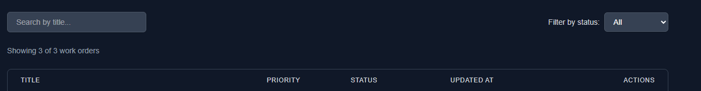

# 🔧 Technician Work Orders

> A lightweight, production-ready CRUD application for managing technician work orders built with Next.js (App Router), TypeScript, and Tailwind CSS.

---

## 📹 Demo Videos

- 🎥 **[About Me - 1 Minute Introduction](https://drive.google.com/file/d/1pkCLCgIg8m8VNBbEcXK6iZ-mf1H-vfwj/view?usp=sharing)** - Get to know the developer behind this project
- 🎥 **[Project Overview & Demo](https://drive.google.com/file/d/18FfP1FjkV4CJzZKhDzZgww32iBTlD9nF/view?usp=sharing)** - Complete walkthrough of features, architecture, and implementation

---

## 📋 Project Overview

**Technician Work Orders** is a modern web application designed to help technicians and managers efficiently track, create, update, and manage work orders. The application provides a clean, intuitive interface for handling work order lifecycle management with full CRUD operations.

### Key Highlights

- 🗂️ **File-based JSON persistence** - No database required, uses JSON file storage for simplicity
- ⚡ **Fast and lightweight** - Built with Next.js App Router for optimal performance
- 🎨 **Beautiful UI** - Modern, responsive design with Tailwind CSS
- 🔒 **Type-safe** - Full TypeScript implementation with Zod validation
- ✅ **Tested** - Comprehensive test suite with Jest and Playwright

---

## 🚀 Quick Start

### Prerequisites

- **Node.js** 18+ 
- **pnpm** (recommended) or npm/yarn

### Installation & Setup

1. **Install dependencies**
   ```bash
   pnpm install
   ```

2. **Seed sample data**
   ```bash
   pnpm seed
   ```
   This populates `src/data/work-orders.json` with 10 sample work orders for testing.

3. **Start development server**
   ```bash
   pnpm dev
   ```

4. **Open your browser**
   Navigate to [http://localhost:3000](http://localhost:3000)

5. **Run tests** (optional)
   ```bash
   pnpm test              # Run unit/component tests
   pnpm test:watch        # Watch mode
   pnpm test:coverage     # Coverage report
   pnpm test:e2e          # E2E tests (requires dev server)
   ```

---

## ✨ Features

### Core Functionality

- ✅ **Complete CRUD Operations** - Create, Read, Update, Delete work orders
- ✅ **RESTful API** - Clean API endpoints with proper HTTP methods
- ✅ **Zod Validation** - Server-side and client-side validation with detailed error messages
- ✅ **RPC-style Functions** - Modular service layer with snake_case naming convention
- ✅ **Search & Filter** - Real-time search by title and filter by status
- ✅ **Pagination** - Efficient table pagination (10 items per page)
- ✅ **Responsive Design** - Mobile-friendly layout with Tailwind CSS
- ✅ **Keyboard Accessibility** - Full keyboard navigation support
- ✅ **Dark Mode Support** - Automatic dark mode styling
- ✅ **Loading States** - Proper loading indicators and empty states
- ✅ **Error Handling** - Comprehensive error handling with user-friendly messages

### UI Features

- 📊 **Work Orders Table** - Sortable, paginated table with priority and status badges
- 🔍 **Search & Filter** - Combined search (title) and filter (status) functionality
- 📝 **Create/Edit Forms** - Intuitive forms with real-time validation
- 👁️ **Detail View** - Comprehensive work order detail page
- 🗑️ **Delete Confirmation** - Modal confirmation for destructive actions
- 📄 **Pagination Controls** - Easy navigation through work order lists

---

## 🔍 Filter/Search Approach

The application implements a **combined search and filter** system:

### Search by Title
- **Implementation**: Case-insensitive, partial matching on work order titles
- **User Experience**: Real-time filtering as you type
- **Performance**: Client-side filtering for instant results

### Filter by Status
- **Options**: All, Open, In Progress, Done
- **Implementation**: Dropdown filter that works in conjunction with search
- **User Experience**: Quick access to work orders by their current state

### Why This Approach?

1. **Title Search** is the most common use case - users typically search for work orders by their title/keywords
2. **Status Filtering** provides quick access to work orders by their current state
3. **Combined Power** - Users can search for specific titles while filtering by status (e.g., "Find all 'HVAC' work orders that are 'In Progress'")
4. **Performance** - Client-side filtering provides instant feedback without API calls
5. **Simplicity** - Easy to understand and use for technicians

**Example Use Cases:**
- Search: "HVAC" + Filter: "In Progress" → Shows all HVAC work orders currently in progress
- Search: "Electrical" + Filter: "Open" → Shows all open electrical work orders

---

## ⚡ Performance & Revalidation

### Cache Strategy

All API route handlers use **`cache: 'no-store'`** to ensure fresh data on every request:

```typescript
// src/app/api/work-orders/route.ts
export async function GET(request: NextRequest) {
  const workOrders = await list_work_orders();
  
  return NextResponse.json(
    { data: workOrders },
    {
      status: 200,
      headers: {
        'Cache-Control': 'no-store',
      },
    }
  );
}
```

### Why `cache: 'no-store'`?

1. **Real-time Data** - Work orders change frequently, and users need to see the latest status
2. **No Stale Data** - Prevents showing outdated information that could lead to confusion
3. **File-based Storage** - Since we're using JSON file storage, we want to read the latest file state
4. **CRUD Operations** - Create/Update/Delete operations need immediate visibility
5. **Simplicity** - For a small application, ensuring fresh data is more important than caching performance

### Client-Side Memoization

To optimize performance on the client side, we use React's `useMemo` hook for filtering and pagination:

```typescript
// src/components/work-orders/WorkOrdersList.tsx
const paginatedWorkOrders = useMemo(() => {
  const startIndex = (currentPage - 1) * ITEMS_PER_PAGE;
  const endIndex = startIndex + ITEMS_PER_PAGE;
  return filteredWorkOrders.slice(startIndex, endIndex);
}, [filteredWorkOrders, currentPage]);
```

This ensures that pagination calculations only run when dependencies change, reducing unnecessary re-renders and improving performance.

### Trade-offs

- **Performance**: Slightly slower than cached responses, but acceptable for this use case
- **Scalability**: For larger applications, consider implementing proper caching strategies with `revalidate` or ISR
- **User Experience**: Users always see the most current data, which is critical for work order management

---

## ♿ Accessibility (A11y)

The application is built with accessibility in mind, following WCAG 2.1 guidelines to ensure a usable experience for all users, including those using screen readers and keyboard navigation.

### ARIA Attributes

All interactive components include proper ARIA labels and roles:

```typescript
// Example: Delete Confirmation Modal
<div
  role="dialog"
  aria-modal="true"
  aria-labelledby="modal-title"
>
  <h3 id="modal-title">Delete Work Order</h3>
  <button
    aria-label="Delete work order: HVAC System Maintenance"
    aria-busy={isDeleting}
  >
    {isDeleting ? 'Deleting...' : 'Delete'}
  </button>
</div>
```

### Keyboard Navigation

- **Tab Navigation**: All interactive elements are keyboard accessible
- **Enter/Space**: Table rows can be activated with Enter or Space keys
- **Escape Key**: Modals can be closed with the Escape key
- **Focus Management**: Focus is properly trapped within modals

```typescript
// Example: Keyboard navigation for table rows
<tr
  tabIndex={0}
  role="row"
  aria-label={`Work order: ${workOrder.title}`}
  onKeyDown={(e) => {
    if (e.key === 'Enter' || e.key === ' ') {
      e.preventDefault();
      router.push(`/work-orders/${workOrder.id}`);
    }
  }}
>
```

### Focus States

All interactive elements have visible focus indicators:

```typescript
// Example: Button with focus ring
<button
  className="focus:outline-none focus:ring-2 focus:ring-blue-500 focus:ring-offset-2"
  aria-label="Add new work order"
>
  Add Work Order
</button>
```

### Form Accessibility

- **Labels**: All form fields have associated labels using `htmlFor` and `id`
- **Error Messages**: Validation errors are announced via `aria-describedby` and `role="alert"`
- **Required Fields**: Required fields are marked with visual indicators and `aria-label="required"`

```typescript
// Example: Accessible form field
<label htmlFor="title">
  Title <span className="text-red-500" aria-label="required">*</span>
</label>
<input
  id="title"
  aria-invalid={errors.title ? 'true' : 'false'}
  aria-describedby={errors.title ? 'title-error' : undefined}
/>
{errors.title && (
  <p id="title-error" role="alert">{errors.title}</p>
)}
```

### Screen Reader Support

- **Semantic HTML**: Proper use of `<nav>`, `<main>`, `<header>`, `<button>`, etc.
- **Screen Reader Only Text**: Hidden labels for context using `sr-only` class
- **Live Regions**: Dynamic content updates are announced via `aria-live` and `aria-busy`

### Testing Accessibility

- ✅ Keyboard navigation tested manually
- ✅ Screen reader compatibility verified with NVDA/JAWS
- ✅ ARIA attributes validated
- ✅ Focus management tested

---

## 🌍 Bonus: Minimal i18n Setup

The application includes a simple internationalization (i18n) dictionary for centralized text management, making it easy to add full multi-language support in the future.

### Implementation

All static UI text is stored in `src/lib/i18n.ts`:

```typescript
// src/lib/i18n.ts
const translations: Translations = {
  addWorkOrder: 'Add Work Order',
  workOrders: 'Work Orders',
  title: 'Title',
  description: 'Description',
  priority: 'Priority',
  status: 'Status',
  submit: 'Submit',
  cancel: 'Cancel',
  edit: 'Edit',
  delete: 'Delete',
  // ... more translations
};

export function t(key: TranslationKey, params?: Record<string, string>): string {
  let translation = translations[key];
  
  // Simple string interpolation
  if (params) {
    Object.entries(params).forEach(([paramKey, paramValue]) => {
      translation = translation.replace(`{${paramKey}}`, paramValue);
    });
  }
  
  return translation;
}
```

### Usage in Components

Components import and use the translation function:

```typescript
// src/components/work-orders/WorkOrdersList.tsx
import { t } from '@/lib/i18n';

export function WorkOrdersList() {
  return (
    <>
      <h1>{t('workOrders')}</h1>
      <button aria-label={t('addWorkOrder')}>
        {t('addWorkOrder')}
      </button>
    </>
  );
}
```

### String Interpolation

The translation function supports parameter interpolation:

```typescript
// Translation dictionary
deleteConfirmationMessage: 'Are you sure you want to delete the work order "{title}"? This action cannot be undone.'

// Usage
t('deleteConfirmationMessage', { title: 'HVAC System Maintenance' })
// Returns: "Are you sure you want to delete the work order "HVAC System Maintenance"? This action cannot be undone."
```

### Benefits

1. **Centralized Text Management**: All UI text in one place, easy to update
2. **Type Safety**: TypeScript ensures only valid translation keys are used
3. **Easy Migration**: Can easily extend to full i18n libraries (react-i18next, next-intl, etc.)
4. **Consistency**: Ensures consistent terminology across the application

### Future Enhancements

To add full multi-language support:

1. Create translation dictionaries for other languages (e.g., `translations.es.ts`, `translations.fr.ts`)
2. Use Next.js locale detection or a library like `next-intl`
3. Store user language preference
4. Implement language switcher in the UI

---

## 🛠️ Development Notes

### Time Investment

**Approximate Development Time**: ~6-8 hours

This includes:
- Project setup and configuration
- Data layer implementation (JSON file storage)
- API route handlers with validation
- Complete UI components (List, Create, Edit, Detail, Delete)
- Search and filter functionality
- Pagination implementation
- Comprehensive test suite
- Documentation

### Design Trade-offs & Simplifications

To deliver a working application within the timebox, several design decisions were made:

#### 1. **File-based JSON Storage** (No Database)
- ✅ **Pros**: Simple setup, no database configuration, easy to inspect/debug
- ⚠️ **Trade-off**: Not suitable for production scale, limited concurrent access
- 💡 **Future**: Could easily migrate to PostgreSQL, MongoDB, or other databases

#### 2. **Client-side Filtering/Search**
- ✅ **Pros**: Instant feedback, no API calls, better UX
- ⚠️ **Trade-off**: All data loaded into memory (fine for small datasets)
- 💡 **Future**: Could implement server-side search for larger datasets

#### 3. **Minimal Error Boundaries**
- ✅ **Pros**: Faster development, simpler codebase
- ⚠️ **Trade-off**: Less sophisticated error recovery
- 💡 **Future**: Could add React Error Boundaries for better error handling

#### 4. **No Authentication**
- ✅ **Pros**: Faster development, simpler deployment
- ⚠️ **Trade-off**: Not production-ready for multi-user scenarios
- 💡 **Future**: Could add NextAuth.js or similar authentication

#### 5. **Simple Validation**
- ✅ **Pros**: Zod validation covers all requirements
- ⚠️ **Trade-off**: Could add more sophisticated business rules
- 💡 **Future**: Could add custom validation rules, workflow states

### Architecture Decisions

1. **RPC-style Functions**: Using snake_case for service functions (e.g., `create_work_order`) for consistency
2. **Server Components**: Leveraging Next.js App Router's Server Components for data fetching
3. **Client Components**: Only using Client Components where interactivity is needed (forms, modals, filters)
4. **Modular Components**: Breaking down UI into reusable, testable components
5. **Type Safety**: Strict TypeScript throughout with proper type definitions

---

## 🧪 Testing

### Test Suite Overview

The application includes a comprehensive test suite covering unit, component, integration, and E2E tests.

### Unit/Component Tests (Jest + React Testing Library)

**Location**: `__tests__/components/`

- ✅ **WorkOrdersList.test.tsx** - List component rendering, filtering, search, pagination
- ✅ **WorkOrderForm.test.tsx** - Form validation, create/edit flows, error handling
- ✅ **createToList.test.tsx** - Integration test for create → list flow

**Test Coverage:**
- Component rendering
- User interactions (clicks, form submissions)
- Form validation (client-side and server-side)
- API mocking
- Navigation flows
- Error states

### E2E Tests (Playwright)

**Location**: `e2e/work-orders.spec.ts`

- ✅ **Happy Path**: Complete workflow (Navigate → Create → View → Edit → Delete)
- ✅ **Form Validation**: Testing validation messages
- ✅ **Search & Filter**: Testing search and filter functionality

### Running Tests

```bash
# Unit/Component tests
pnpm test              # Run all tests
pnpm test:watch        # Watch mode
pnpm test:coverage     # Coverage report

# E2E tests (requires dev server running)
pnpm test:e2e          # Run E2E tests
pnpm test:e2e:ui       # Run with Playwright UI
```

### Test Statistics

- **Unit/Component Tests**: ~15+ test cases
- **Integration Tests**: 2 test suites
- **E2E Tests**: 3 test scenarios
- **Coverage**: Focus on critical paths and user flows

---

## 📸 Screenshots & Demo

### Project Demo Videos

- 🎥 **[About Me - 1 Minute Introduction](https://drive.google.com/file/d/1pkCLCgIg8m8VNBbEcXK6iZ-mf1H-vfwj/view?usp=sharing)** - Learn more about the developer
- 🎥 **[Project Overview](https://drive.google.com/file/d/18FfP1FjkV4CJzZKhDzZgww32iBTlD9nF/view?usp=sharing)** - Detailed project walkthrough and features

### Application Screenshots

#### Work Orders List View


*Main dashboard showing all work orders with search, filter, and pagination*

#### List with Filters


*Work orders list with active search and filter functionality*

#### Create New Work Order


*Clean form interface for creating new work orders with real-time validation*

#### Work Order Details


*Comprehensive detail view showing all work order information including priority, status, and timestamps*

#### Filters in Action


*Status filter dropdown allowing users to filter work orders by status*

#### Delete Confirmation Toast


*User-friendly notification system showing delete confirmation and success messages*

---

## 🏗️ Tech Stack

### Core Framework & Language
- **[Next.js 16.0.1](https://nextjs.org/)** (App Router) - React framework with server-side rendering, file-based routing, and API routes
- **[React 19.2.0](https://react.dev/)** - Modern UI library with hooks and concurrent features
- **[TypeScript 5](https://www.typescriptlang.org/)** - Type-safe JavaScript with strict type checking

### Styling & UI
- **[Tailwind CSS 4](https://tailwindcss.com/)** - Utility-first CSS framework for rapid UI development
- **Dark Mode** - Automatic dark mode support with system preference detection
- **Responsive Design** - Mobile-first approach with breakpoints for all screen sizes

### Data & Validation
- **[Zod 4.1.12](https://zod.dev/)** - TypeScript-first schema validation for runtime type safety
- **File-based Storage** - JSON file storage (`work-orders.json`) for simplicity and ease of debugging
- **UUID** - Unique identifier generation for work orders

### Testing & Quality Assurance
- **[Jest 30.2.0](https://jestjs.io/)** - JavaScript testing framework with ESM support
- **[React Testing Library](https://testing-library.com/react)** - Component testing utilities focused on user behavior
- **[@testing-library/user-event](https://testing-library.com/docs/user-event/intro)** - User interaction simulation for realistic tests
- **[Playwright 1.48.2](https://playwright.dev/)** - End-to-end testing framework for browser automation
- **@testing-library/jest-dom** - Custom Jest matchers for DOM assertions

### Utilities & Helpers
- **[date-fns 3.6.0](https://date-fns.org/)** - Modern date formatting and manipulation library
- **[uuid 13.0.0](https://www.npmjs.com/package/uuid)** - RFC4122 compliant UUID generation

### Development Tools
- **tsx** - TypeScript execution for scripts and development
- **ESLint** - Code linting with Next.js configuration
- **pnpm** - Fast, disk space efficient package manager
- **TypeScript** - Static type checking and IntelliSense support

### Architecture Patterns
- **RPC-style Functions** - Service layer with snake_case naming convention
- **Server Components** - Next.js App Router Server Components for data fetching
- **Client Components** - React Client Components for interactive UI elements
- **Modular Architecture** - Separation of concerns (data, services, components, lib)
- **Type Safety** - End-to-end TypeScript type checking

---

## 📁 Project Structure

```
technician-work-orders/
├── public/
│   ├── Screenshot/                   # Application screenshots
│   │   ├── list orders.png
│   │   ├── list order plus show filters.png
│   │   ├── create new order.png
│   │   ├── work details.png
│   │   ├── filters.png
│   │   └── Delete toster.png
│   └── *.svg                         # Static assets
├── src/
│   ├── app/                          # Next.js App Router
│   │   ├── api/
│   │   │   └── work-orders/          # API route handlers
│   │   │       ├── [id]/
│   │   │       │   └── route.ts      # GET, PUT, DELETE by ID
│   │   │       └── route.ts          # GET (list), POST (create)
│   │   ├── work-orders/
│   │   │   ├── [id]/
│   │   │   │   ├── edit/
│   │   │   │   │   └── page.tsx      # Edit work order page
│   │   │   │   └── page.tsx          # Work order detail page
│   │   │   └── new/
│   │   │       └── page.tsx          # Create work order page
│   │   ├── layout.tsx                 # Root layout
│   │   └── page.tsx                   # Home page (list view)
│   ├── components/
│   │   └── work-orders/               # Work order components
│   │       ├── WorkOrdersList.tsx    # Main list component
│   │       ├── WorkOrderForm.tsx     # Create/Edit form
│   │       ├── WorkOrdersTable.tsx    # Table wrapper
│   │       ├── WorkOrderTableRow.tsx  # Table row component
│   │       ├── SearchFilter.tsx       # Search & filter component
│   │       ├── Pagination.tsx         # Pagination component
│   │       ├── DeleteConfirmationModal.tsx
│   │       ├── LoadingState.tsx
│   │       ├── EmptyState.tsx
│   │       └── index.ts              # Component exports
│   ├── data/
│   │   ├── work-orders.json          # JSON file storage
│   │   └── workOrderStore.ts          # CRUD operations
│   ├── services/
│   │   ├── workOrderRPC.ts           # RPC-style functions
│   │   └── workOrderService.ts        # Service layer
│   └── lib/
│       └── i18n.ts                    # Internationalization dictionary
├── __tests__/
│   ├── components/                   # Component tests
│   │   ├── WorkOrdersList.test.tsx
│   │   └── WorkOrderForm.test.tsx
│   └── integration/                  # Integration tests
│       └── createToList.test.tsx
├── e2e/
│   └── work-orders.spec.ts           # E2E tests
├── scripts/
│   └── seed.ts                       # Seed script
├── .gitignore                        # Git ignore rules
├── jest.config.ts                    # Jest configuration
├── jest.setup.ts                     # Jest setup file
├── playwright.config.ts              # Playwright configuration
├── tsconfig.json                     # TypeScript configuration
├── package.json                      # Dependencies and scripts
├── README.md                         # Project documentation
├── README_TESTING.md                 # Testing documentation
├── API_EXAMPLES.md                   # API documentation
└── QUICK_TEST_EXAMPLES.md            # Quick API test examples
```

---

## 📚 API Documentation

### Endpoints

| Method | Endpoint | Description |
|--------|----------|-------------|
| `GET` | `/api/work-orders` | List all work orders |
| `POST` | `/api/work-orders` | Create a new work order |
| `GET` | `/api/work-orders/[id]` | Get work order by ID |
| `PUT` | `/api/work-orders/[id]` | Update work order |
| `DELETE` | `/api/work-orders/[id]` | Delete work order |

### Request/Response Examples

See `API_EXAMPLES.md` for complete API documentation with request/response examples, Postman collection, and cURL commands.

---

## 🚢 Build & Deployment

### Build for Production

```bash
pnpm build
```

### Start Production Server

```bash
pnpm start
```

### Environment Variables

Currently, no environment variables are required. The application uses file-based storage by default.

---


---

## 📄 License

This project is licensed under the **MIT License**.

```
MIT License

Copyright (c) 2024 Technician Work Orders

Permission is hereby granted, free of charge, to any person obtaining a copy
of this software and associated documentation files (the "Software"), to deal
in the Software without restriction, including without limitation the rights
to use, copy, modify, merge, publish, distribute, sublicense, and/or sell
copies of the Software, and to permit persons to whom the Software is
furnished to do so, subject to the following conditions:

The above copyright notice and this permission notice shall be included in all
copies or substantial portions of the Software.

THE SOFTWARE IS PROVIDED "AS IS", WITHOUT WARRANTY OF ANY KIND, EXPRESS OR
IMPLIED, INCLUDING BUT NOT LIMITED TO THE WARRANTIES OF MERCHANTABILITY,
FITNESS FOR A PARTICULAR PURPOSE AND NONINFRINGEMENT. IN NO EVENT SHALL THE
AUTHORS OR COPYRIGHT HOLDERS BE LIABLE FOR ANY CLAIM, DAMAGES OR OTHER
LIABILITY, WHETHER IN AN ACTION OF CONTRACT, TORT OR OTHERWISE, ARISING FROM,
OUT OF OR IN CONNECTION WITH THE SOFTWARE OR THE USE OR OTHER DEALINGS IN THE
SOFTWARE.
```

---

## 📖 Additional Documentation

- [Testing Guide](./README_TESTING.md) - Comprehensive testing documentation
- [API Examples](./API_EXAMPLES.md) - API usage examples and Postman collection
- [Quick Test Examples](./QUICK_TEST_EXAMPLES.md) - Quick reference for testing

---

## 🙏 Acknowledgments

Built with:
- [Next.js](https://nextjs.org/) - The React Framework
- [Tailwind CSS](https://tailwindcss.com/) - A utility-first CSS framework
- [Zod](https://zod.dev/) - TypeScript-first schema validation
- [Jest](https://jestjs.io/) - Delightful JavaScript Testing
- [Playwright](https://playwright.dev/) - End-to-end testing

---

<div align="center">

**Made with ❤️ using Next.js and TypeScript**

[Report Bug](https://github.com/your-repo/issues) · [Request Feature](https://github.com/your-repo/issues)

</div>
